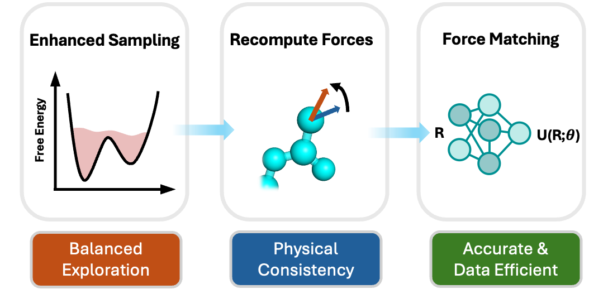

# biased-force-matching

This repository contains supporting code accompanying the paper:
> [**Enhanced Sampling for Efficient Training of Coarse Grained Machine Learning Potentials**](https://pubs.acs.org/doi/10.1021/acs.jctc.5c00996) 
> *Journal of Chemical Theory and Computation (JCTC)*, 2025  
> DOI: [**10.1021/acs.jctc.5c01712**](https://pubs.acs.org/doi/10.1021/acs.jctc.5c00996)

  
_Figure: Table of contents graphic from the paper._

## Installation

The core setup and source code are located in the [chemtrain repository](https://github.com/tummfm/chemtrain).

This project depends on `chemtrain` with a CUDA-enabled JAX backend.  
Installation is managed primarily through Conda,

First, create the environment from the provided `environment.yml`:

```bash
conda env create -f environment.yml
conda activate biased_fm
```
After activating the environment, install chemutils manually under `chemutils` folder:
```bash
pip install -e chemutils
```

If you use `biased-force-matching` / `enhanced-sampling-force-matching`, please cite the following works:

```bibtex
@article{chen2026enhanced,
  title={Enhanced Sampling for Efficient Learning of Coarse-Grained Machine Learning Potentials},
  author={Chen, Weilong and Görlich, Franz and Fuchs, Paul and Zavadlav, Julija},
  journal={Journal of Chemical Theory and Computation},
  volume = {22},
  number = {1},
  pages = {219-230},
  year = {2026},
  doi = {10.1021/acs.jctc.5c01712},
  URL = {https://doi.org/10.1021/acs.jctc.5c01712},
  publisher={ACS Publications}
}
```

